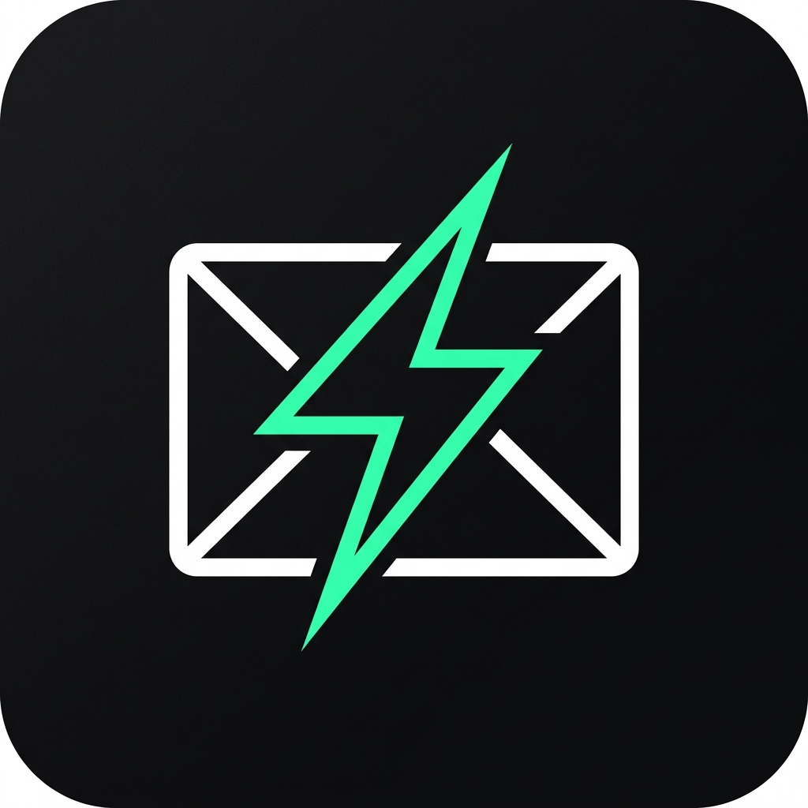

<div align="center">



# smart-mailto

**The zero-dependency, zero-backend smart email dispatcher for modern web apps.**  
*Replaces broken desktop `mailto:` dead-ends with instant webmail deep-links (Gmail, Outlook, Proton, Yahoo) and seamless native mobile sheets.*

[](https://www.npmjs.com/package/smart-mailto)
[](https://bundlephobia.com/package/smart-mailto)
[](packages/smart-mailto/tests)
[](LICENSE)
[](packages/smart-mailto)
[](packages/smart-mailto/package.json)

[Live Interactive Playground](https://smart-mailto.dev) · [Quickstart](#-quickstart) · [React Hook](#2-headless-react-hook-usesmartmailto) · [Components](#3-drop-in-react-components) · [API Reference](#-api-reference) · [Comparison](#-comparison-matrix)

</div>

---

## ⚡ The Problem: Why `smart-mailto`?

* ❌ **Standard `mailto:` fails on desktop**: Clicking `mailto:` on macOS or Windows launches unconfigured native mail apps (like Apple Mail or Windows Mail), resulting in dead-ends and 40%+ inbound lead drop-off.
* ⚠️ **Backend contact forms are heavy**: Setting up contact forms requires backend servers, databases, SMTP relays (Resend, SendGrid), CAPTCHAs, and spam filters.
* 💀 **`mailgo` is dead**: The older alternative (`mailgo`, 3,200+ GitHub stars) was officially **archived and deprecated in January 2024**, leaving web developers without a modern, maintained replacement.
* ✅ **`smart-mailto` fixes this**: Runs 100% client-side with **zero external dependencies** (< 2 kB gzipped), deep-linking desktop users directly into active webmail composers while preserving native system sheets on mobile!

---

## 🚀 Key Features

* 🌐 **Multi-Provider Webmail Routing**: Generates direct compose deep-links for **Gmail**, **Outlook / Office 365**, **ProtonMail**, **Yahoo Mail**, and native **mailto:**.
* 📱 **Multi-Signal Device Detection**: Intelligently classifies desktop vs. mobile using pointer precision (`(pointer: coarse)`), touch points, and viewport metrics with **100% SSR safety** (Next.js App Router, Remix, Astro, Vite).
* 🛡️ **Popup Blocker Resiliency**: Detects blocked popups automatically and recovers gracefully by syncing the draft directly to the user's clipboard.
* 📏 **Safe URL Length Guard**: Validates query strings against the browser 2,000 character threshold to eliminate `414 URI Too Long` crashes.
* 📊 **Zero-Cookie Lead Telemetry**: Optionally appends page source URL, timestamp, and device environment into message drafts for recipient context.
* 🧩 **Headless & Drop-in Primitives**:
  * Headless React Hook: `useSmartMailto()`
  * Drop-in Accessible Button: `<SmartMailtoButton />`
  * Multi-Provider Dropdown: `<SmartMailtoMenu />`
  * Zero-Backend Contact Modal: `<SmartMailtoModal />`
* 🤖 **AI-Agent Ready**: Includes machine-readable [`/llms.txt`](apps/web/public/llms.txt), [`AGENTS.md`](AGENTS.md), and integration [`SKILL.md`](packages/smart-mailto/SKILL.md).

---

## 📦 Installation

```bash
# pnpm
pnpm add smart-mailto

# npm
npm install smart-mailto

# yarn
yarn add smart-mailto

# bun
bun add smart-mailto
```

---

## 🛠️ Quickstart

### 1. Framework-Agnostic (Vanilla TypeScript / JavaScript)

Works in any environment (Node, browser, Vite, Astro, Svelte, Vue):

```ts
import { dispatchSmartEmail } from "smart-mailto";

// Automatically opens Gmail compose tab on desktop, or native mail app on mobile!
const result = await dispatchSmartEmail({
  recipient: "contact@company.com",
  subject: "Partnership Opportunity",
  body: "Hi team, I would like to explore collaborating on...",
});

console.log("Dispatched via:", result.provider);
```

---

### 2. Headless React Hook (`useSmartMailto`)

Build any 100% custom UI (Tailwind, shadcn/ui, Radix, Mantine):

```tsx
import { useSmartMailto } from "smart-mailto/react";

export function ContactButton() {
  const { send, isCopied, copyAddress, isDispatching } = useSmartMailto({
    recipient: "founders@company.com",
    subject: "Product Inquiry",
    body: "Hi! I have questions regarding enterprise onboarding.",
    telemetry: true, // Appends current URL and timestamp to draft
  });

  return (
    <div className="flex gap-2">
      <button 
        onClick={() => send()} 
        disabled={isDispatching}
        className="px-4 py-2 bg-emerald-500 text-black font-semibold rounded-lg hover:bg-emerald-400"
      >
        {isDispatching ? "Opening..." : "Email Founders"}
      </button>

      <button 
        onClick={copyAddress}
        className="px-3 py-2 border border-gray-700 text-gray-300 rounded-lg hover:bg-gray-800"
      >
        {isCopied ? "Address Copied!" : "Copy Email"}
      </button>
    </div>
  );
}
```

---

### 3. Drop-in React Components

#### `<SmartMailtoButton />` (Progressive Enhancement)
Interprets clicks for smart routing while preserving semantic `mailto:` `href` for SEO and screen readers:

```tsx
import { SmartMailtoButton } from "smart-mailto/react";

<SmartMailtoButton
  recipient="founders@company.com"
  subject="General Inquiry"
  className="btn-primary"
>
  Email Our Team
</SmartMailtoButton>
```

#### `<SmartMailtoMenu />` (Multi-Provider Dropdown)
Accessible dropdown allowing visitors to explicitly select their preferred email service:

```tsx
import { SmartMailtoMenu } from "smart-mailto/react";

<SmartMailtoMenu
  recipient="support@company.com"
  subject="Technical Support"
  triggerLabel="Contact Support"
  theme="dark" // "dark" | "light"
/>
```

#### `<SmartMailtoModal />` (Plug-and-Play Obsidian Modal)
Full contact inquiry dialog with keyboard shortcuts (`Escape`, `⌘↵`), input validation, and zero server requirements:

```tsx
import { useState } from "react";
import { SmartMailtoModal } from "smart-mailto/react";

export function InquirySection() {
  const [open, setOpen] = useState(false);

  return (
    <>
      <button onClick={() => setOpen(true)}>Get in Touch</button>

      <SmartMailtoModal
        isOpen={open}
        onClose={() => setOpen(false)}
        recipient="sales@company.com"
        title="Schedule an Enterprise Demo"
        theme="dark" // "dark" | "light"
        showCompanyField={true}
      />
    </>
  );
}
```

---

## 🛠️ API Reference

### `SmartMailtoOptions`

| Property | Type | Default | Description |
| :--- | :--- | :--- | :--- |
| `recipient` | `string` | *(Required)* | Destination email address (`"team@acme.com"`). |
| `subject` | `string` | `""` | Pre-filled email subject line. |
| `body` | `string` | `""` | Pre-filled email message body. |
| `cc` | `string \| string[]` | `undefined` | CC recipient(s). |
| `bcc` | `string \| string[]` | `undefined` | BCC recipient(s). |
| `defaultProvider` | `EmailProvider \| "auto"` | `"gmail"` | Preferred webmail provider for desktop browsers. |
| `fallbackToMailtoOnMobile` | `boolean` | `true` | Routes to native `mailto:` on touch/mobile devices. |
| `copyOnPopupBlock` | `boolean` | `true` | Auto-copies body to clipboard if browser blocks popup. |
| `maxUrlLength` | `number` | `2000` | Character limit threshold to prevent `414 URI Too Long` errors. |
| `telemetry` | `boolean \| TelemetryOptions` | `false` | Attaches current URL, timestamp, and device metadata to draft. |

### `useSmartMailto` Return Value

| Return Property | Type | Description |
| :--- | :--- | :--- |
| `send(provider?)` | `(explicitProvider?) => Promise<DispatchResult>` | Dispatches to webmail (desktop) or native sheet (mobile). |
| `copyAddress()` | `() => Promise<boolean>` | Copies recipient email address to clipboard. |
| `copyDraft()` | `() => Promise<boolean>` | Copies formatted recipient, subject, and body to clipboard. |
| `isCopied` | `boolean` | `true` for 2 seconds following any clipboard copy operation. |
| `isDispatching` | `boolean` | `true` while dispatch operation is executing. |
| `isMobile` | `boolean` | SSR-safe boolean indicating coarse-touch / mobile environment. |
| `deviceType` | `"mobile" \| "tablet" \| "desktop"` | Detected client device category. |
| `providerUrls` | `Record<EmailProvider, string>` | Precomputed compose URLs for all supported providers. |

---

## 📋 Comparison Matrix

| Capability | Traditional `mailto:` | Server Forms (Resend/SendGrid) | Deprecated `mailgo` | `smart-mailto` |
| :--- | :---: | :---: | :---: | :---: |
| **Desktop Webmail Routing** | ❌ Fails / Opens Native App | ❌ N/A | ⚠️ Generic Modal | **✅ Direct Webmail Tab** |
| **Mobile Native Mail Sheet** | ✅ Yes | ❌ N/A | ⚠️ Broken on new iOS | **✅ Seamless Multi-Signal** |
| **Server & Infrastructure Cost** | ✅ Free | ❌ $15–$50+/mo | ✅ Free | **✅ $0 (100% Client-Side)** |
| **Zero External Dependencies** | ✅ Yes | ❌ Needs API SDKs | ❌ Multiple deps | **✅ 0 Dependencies (<2 kB)** |
| **Maintenance Status** | ⚠️ Unchanged since 1998 | ✅ Actively Maintained | 💀 Archived Jan 2024 | **✅ Active (2026)** |
| **Popup Blocker Recovery** | ❌ None | ❌ None | ❌ None | **✅ Auto-Clipboard Sync** |
| **Safe URL Length Guard** | ❌ Browser 414 Crash | ✅ Handled by server | ❌ None | **✅ Auto-Clipboard Guard** |
| **React 18 & 19 Support** | ⚠️ Raw HTML only | ⚠️ Custom form needed | ❌ Stale React 16/17 | **✅ Native React 18 & 19** |
| **Next.js SSR Safety** | ✅ Yes | ✅ Yes | ❌ Hydration Mismatches | **✅ 100% SSR Guarded** |

---

## 🌐 Supported Webmail Providers

| Provider | Supported Environments | Direct Compose Format |
| :--- | :--- | :--- |
| **Gmail** | Desktop Chrome, Safari, Firefox, Edge | `https://mail.google.com/mail/?view=cm&fs=1&to=...` |
| **Outlook / 365** | Desktop Corporate, Personal Hotmail | `https://outlook.live.com/mail/0/deeplink/compose?to=...` |
| **ProtonMail** | Desktop Encrypted Webmail | `https://mail.proton.me/compose?to=...` |
| **Yahoo Mail** | Desktop Yahoo Webmail | `https://compose.mail.yahoo.com/?to=...` |
| **Native Mail** | iOS Mail, Android Gmail App, OS Handlers | `mailto:user@example.com?subject=...` |

---

## 💻 Monorepo Workspace & Local Development

This repository is organized as a lightweight `pnpm` workspace:
* `packages/smart-mailto`: Core library, React hooks, and UI components.
* `apps/web`: Interactive showcase and documentation studio.

```bash
# Clone & install
git clone https://github.com/akm2006/smart-mailto.git
cd smart-mailto
pnpm install

# Run interactive documentation & dev server
pnpm dev

# Run Vitest test suite (26 unit tests)
pnpm test

# Run TypeScript typechecks
pnpm -r typecheck

# Full production build
pnpm -r build
```

---

## 🤝 Contributing

Contributions, bug reports, and provider requests are welcome! Please check out [CONTRIBUTING.md](CONTRIBUTING.md) for contribution guidelines.

---

## 📄 License

MIT © [Akash (akm2006)](https://github.com/akm2006)
